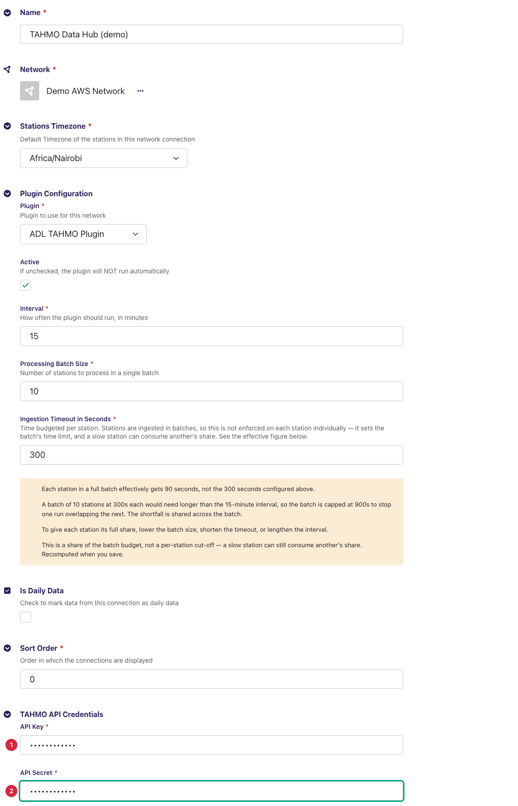
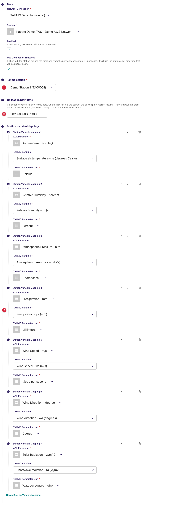
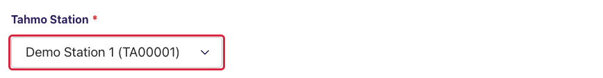
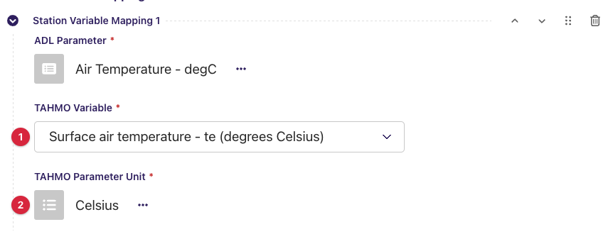
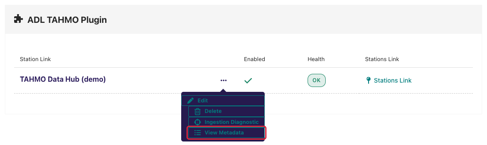
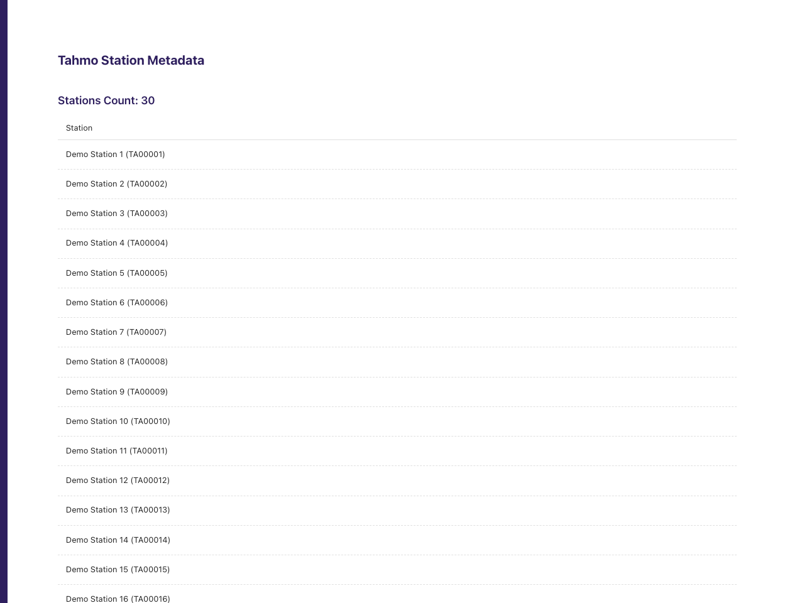
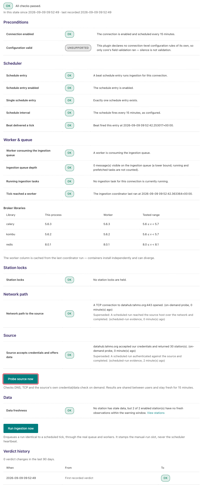
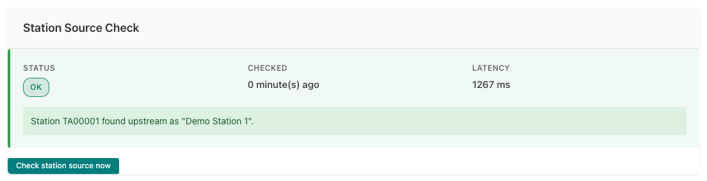

---
adl_plugin:
  name: ADL TAHMO Plugin
  connects_to: "[TAHMO](https://tahmo.org) Data Hub API"
  category: general
  choose_when: Your stations are part of the TAHMO network.
---
# ADL TAHMO Plugin

Collects observation data from stations of the **Trans-African Hydro-
Meteorological Observatory (TAHMO)** network through the **TAHMO Data Hub
REST API** and saves it into an ADL instance. This is a *pull* plugin: on
each collection cycle ADL asks the API for the raw measurements of each
linked station over a time window and stores the values of the variables
you have mapped against your ADL stations and data parameters.

**Repository:** [adl-tahmo-plugin](https://github.com/wmo-raf/adl-tahmo-plugin)
**Plugin type identifier:** `adl_tahmo_plugin`
**Connection model:** `TahmoConnection` · **Station link model:** `TahmoStationLink`

> **About the screenshots.** Every image in this guide is regenerated from
> `docs/screenshots.yml` against a seeded demo instance, so hostnames, station
> names, ids and readings in them are placeholders — not values to copy. The
> field tables are the reference for what to enter.

## Overview

TAHMO identifies each station by a **station code** (`TA00123`) and each
measured quantity by a **variable shortcode** (`te` air temperature, `rh`
relative humidity, `pr` precipitation, `ws` wind speed, `wd` wind direction,
`ap` atmospheric pressure, `ra` shortwave radiation, and so on). Both lists
come from the API for the account behind your key, and the plugin loads them
into the station link form so you pick rather than type.

One collection cycle, per enabled station link: the plugin calls the *raw
measurements* endpoint for the station over the run's window, groups the
returned entries by timestamp, keeps the values whose quality flag is 1, and
hands the records to ADL, which stores the mapped variables after unit
conversion. A record's keys are the variable shortcodes, so a mapping's
*TAHMO Variable* is exactly the key that carries its value.

The Data Hub host is fixed in the plugin (`datahub.tahmo.org`); the
connection holds only the credentials.

## Prerequisites

- A running ADL instance (see [Installation](https://adl-tool.readthedocs.io/en/latest/installation.html)).
- A **TAHMO Data Hub API key and secret** for an account that has access to
  the stations you want to collect. TAHMO issues these per partner
  organisation; contact TAHMO through [tahmo.org](https://tahmo.org) if you
  do not have them. The same pair serves every station on the account.
- Outbound HTTPS (port 443) from the ADL host to `datahub.tahmo.org` —
  check this first on networks with restrictive firewalls.

## Installation

Installed like any ADL plugin — see [Plugin Installation](https://adl-tool.readthedocs.io/en/latest/developer_guide/plugins/plugin_installation.html) for
all methods. The `plugins.toml` entry:

```toml
[[plugins]]
name = "ADL TAHMO Plugin"
git  = "https://github.com/wmo-raf/adl-tahmo-plugin.git"
tag  = "0.2.1"
```

After rebuild/restart, confirm with `docker compose exec adl list-plugins`.

## Connection configuration

In the ADL admin, create a new **TAHMO API Connection**. Base connection
fields (name, network, plugin, processing interval, stations timezone) are
described in [Manage Connections](https://adl-tool.readthedocs.io/en/latest/user_guide/manage_connections.html).
Plugin-specific fields, under *TAHMO API Credentials*:

| Field | Required | Default | Description |
|---|---|---|---|
| API Key | yes | — | The Data Hub API key. Sent as the username of HTTP basic authentication on every request. |
| API Secret | yes | — | The secret paired with the key, sent as the password. Never appears in messages or logs. |



> **Before 0.2.1, keep this connection in UTC.** Releases up to 0.2.0 wrote
> the run's window into the API request as UTC without converting it from
> the station's local time, so a connection in any other *Stations Timezone*
> asked for a window shifted by that offset and never fetched the hours in
> between. From 0.2.1 the window is converted and any timezone works.

The connection has no variable mappings of its own: TAHMO stations carry
different sensor sets, so mappings are defined **per station link**.

## Station link configuration

For each station to collect, create a **TAHMO Station Link**:

| Field | Required | Default | Description |
|---|---|---|---|
| Tahmo Station | yes | — | The station to collect, chosen from the list the plugin loads from the Data Hub once the *Network Connection* above it is selected. Each option reads *location name (station code)*; the stored value is the code (`TA00123`). |
| Collection Start Date | no | empty | Collection never starts before this date, and it must be in the past. On the first run it is the start of the backfill; afterwards, moving it forward past the latest saved record skips the gap. Leave empty to start from the last 24 hours. |
| Station Variable Mappings | yes (at least one) | — | One row per value to store; see below. A station with no mappings collects nothing. |



### Station variable mappings

| Field | Description |
|---|---|
| ADL Parameter | The ADL `DataParameter` the values are stored under. |
| TAHMO Variable | The variable, chosen from the list the plugin loads from the Data Hub for the selected connection. Each option reads *description - shortcode (units)*, e.g. *Air temperature - te (degrees Celsius)*; the stored value is the shortcode, which is the key the plugin reads from each measurement. |
| TAHMO Parameter Unit | The ADL unit matching the units shown in brackets on the variable. ADL converts from it to the ADL parameter's unit. |

**Example:** ADL Parameter `Air Temperature` ← TAHMO Variable *Air temperature
- te (degrees Celsius)* → Unit `degC`; ADL Parameter `Relative Humidity` ←
*Relative humidity - rh (-)* → Unit `percent` (see the note on `rh` under
*Data collection behavior*).

Only mapped shortcodes are stored: the API returns every variable the
station reports, ADL keeps the mapped ones.

## Admin UI added by this plugin

The plugin adds two surfaces: the **remote-loading selects** on the station
link form (station and variable), and a **View Metadata** page listing the
account's stations.

### Step 1 — pick the connection, then the station

On the station link form, select the *Network Connection* first. The *Tahmo
Station* select shows a spinner while it fetches the account's station list,
then fills with *location name (code)* options. Changing the connection
clears and reloads the list. A connection that has just been created must be
saved before its list can load.



### Step 2 — add a mapping row and pick the variable

Under *Station Variable Mappings*, add a row. The *TAHMO Variable* select
loads the Data Hub's variable catalogue for the connection, one option per
shortcode with its description and units. Note the units, then choose the
matching *TAHMO Parameter Unit*.



The catalogue is account-wide, not per station: a variable listed here is
not necessarily reported by the station you chose. If in doubt, map it and
check the station's data after the first run.

### What the selects report when something is wrong

A message above the select replaces its options when the call behind it
fails:

| Message | Meaning | What to do |
|---|---|---|
| `Network connection ID is required.` | No connection is selected yet. | Select the *Network Connection* first. |
| `The selected connection is not a Tahmo API Connection` | The chosen connection belongs to another plugin. | Pick a TAHMO connection. |
| `No variables found for the selected connection.` | The Data Hub returned an empty variable catalogue. | Run the connection's source check (below); if it passes, contact TAHMO. |
| `HTTP error! Status: 500` (or an empty list with no message) | The API call itself failed — wrong key or secret, or no network. | Run *Probe source now* on the connection's Ingestion Diagnostic page; the feedback catalogue maps the result to a fix. |

### Step 3 — View Metadata

On the **Network Connections** list, each TAHMO connection row carries a
**View Metadata** action in its **…** menu (list icon). It opens, in a new
tab, the **Tahmo Station Metadata** page: the *Stations Count* for the
account and a one-column table listing every station as *location name
(code)*. Use it to confirm which stations the key can see before linking
them, and to look up a code when creating stations in ADL.





The list is the same cached station list the selects use (see *Caches*); a
station newly added to the account can take up to a day to appear.

## Data collection behavior

- **Window.** Each run asks for the window from the later of the latest
  saved observation plus one minute and the *Collection Start Date*, up to
  the top of the next hour. With neither, the first run starts **24 hours
  ago**.
- **Timezones.** The window bounds ADL computes in the station's timezone
  are converted to UTC and sent as `YYYY-MM-DDTHH:MM:SSZ`, so the
  connection's *Stations Timezone* only affects how ADL rounds the window.
  Measurement timestamps come back as ISO instants with their offset and are
  stored as such. *Before 0.2.1* the bounds were sent unconverted — see the
  note under *Connection configuration*.
- **What is kept.** The API returns one entry per variable and timestamp,
  with a *quality* flag. The plugin keeps an entry when its quality is 1
  and it carries a value; a zero reading (no rain, calm wind) is a value
  and is stored. *Before 0.2.1* zero readings were dropped as if missing.
  Relative humidity (`rh`) arrives as a fraction and is multiplied by 100,
  so map it with unit `percent`.
- **Backfill.** Set *Collection Start Date* before the first run. The API
  serves history, so a start date months back is honoured; the run fetches
  the whole window in one request.
- **Sensors.** All sensors of the station are requested together; if a
  station carries two sensors for one variable, the entries are merged by
  timestamp and the later one wins.
- **Caches.** The station list and the variable catalogue are cached for 24
  hours per API key (they drive the selects and the metadata page). The
  measurements call is never cached.
- **Request budget.** Every API call has a 30-second timeout, so a hung
  source fails the run rather than wedging the worker.

## Source checks / diagnostics

The plugin implements the ADL source-check contracts, so the core's
monitoring screens can tell network faults, credential faults and
configuration faults apart *for this connection specifically*. The screens
below are rendered by the ADL core, but what they display for a TAHMO
connection comes from this plugin. The core's own messages on the same
screens are catalogued in [Monitoring & Diagnostics](https://adl-tool.readthedocs.io/en/latest/user_guide/monitoring_and_diagnostics.html).

### Where check results appear

**Ingestion Diagnostic page.** From the connections list, the Health column
of your TAHMO connection links to its **Ingestion Diagnostic** page
(`/monitoring/connection/<id>/health/`). It shows a layered verdict —
network reachability of `datahub.tahmo.org` at the bottom, then whether the
API accepted your key and secret — with a verdict history. **Probe source
now** re-dials the source immediately (at most once per minute); **Run
ingestion now** triggers a full collection cycle.



**Station Source Check panel.** Open a station link's **Inspect** page (from
the station links list, via the row's **…** menu). Alongside the Collection
Status card — which also offers **Trigger Collection Now** — the **Station
Source Check** card shows the latest station-level result: a status badge
(OK / FAILED), when it was checked, the latency, and the message produced by
this plugin.



### What each check verifies

| Check | What it verifies |
|---|---|
| Endpoint probe | DNS resolution and TCP reach of `datahub.tahmo.org:443`. Run by the core; the plugin only names the endpoint. |
| Connection check | Calls the station list (`/services/assets/v2/stations`) fresh — cache bypassed, 5-second timeout, no retries — with your key and secret, and claims OK only from a parsed station list, never from a bare HTTP 200, so a login page cannot masquerade as success. |
| Station check | Confirms the configured station code appears in the account's current station list, also bypassing the cache, and reports the upstream location name so a valid-but-wrong code is caught. |

### Feedback catalogue — messages this plugin produces

Messages name the host and the path without query strings, so credentials
never appear in them. Find the message you see:

| Message (example) | Status | Meaning | What to do |
|---|---|---|---|
| `datahub.tahmo.org accepted our credentials and returned 42 station(s).` | OK | Key and secret valid; the station list is readable. The count is the number of stations visible to the account. | Nothing — healthy. |
| `Station TA00123 found upstream as "Kabete".` | OK | The code exists on the account; the location name is shown so you can confirm it is the station you meant. | Check the name matches your intended station. |
| `Station TA00123 was found in the source's station list.` | OK | As above, but the Data Hub gave the station no location name. | Nothing. |
| `datahub.tahmo.org returned HTTP 401 for /services/assets/v2/stations.` | FAILED | The API rejected the key/secret pair. | Re-enter *API Key* and *API Secret*. |
| `datahub.tahmo.org returned HTTP 403 for /services/assets/v2/stations.` | FAILED | Credentials accepted but the account may not read stations. | Ask TAHMO about the account's permissions. |
| `datahub.tahmo.org returned HTTP 404 for /services/assets/v2/stations.` | FAILED | The endpoint moved — an API change on TAHMO's side. | Check for a newer plugin release. |
| `datahub.tahmo.org returned HTTP 5xx for /services/assets/v2/stations.` | FAILED | The Data Hub itself errored. | Retry later. |
| `datahub.tahmo.org answered, but the response was not a station list.` | FAILED | Something responded, but not the API — a proxy page, a login redirect, or a body without a `data` list. | Check any proxy between ADL and the API. |
| `datahub.tahmo.org could not be reached: <error>` | FAILED | Network-level failure: DNS, firewall, TLS, or timeout. The wrapped error says which. | Check connectivity from the ADL host; see Prerequisites. |
| `Station TA00123 was not found in the source's station list.` | FAILED | Positive proof the code is absent from the account — a typo, or the station is not shared with this account. | Re-select the station on the station link form; ask TAHMO to share it. |
| `Could not read the station list from datahub.tahmo.org: <error>` | FAILED | The station check could not fetch the list, so it proves nothing about this station. | Fix the connection-level failure first, then re-check. |

## Troubleshooting

**Connection check passes but a station collects nothing**
: Confirm the station check passes, then check the mapped variables are
  ones this station reports (a TAHMO station without a pressure sensor
  yields nothing for `ap`). On a plugin release before 0.2.1, also confirm
  the connection's timezone is UTC — a shifted window was the most common
  cause of empty runs.

**Rainfall is never zero; calm wind is missing**
: A plugin release before 0.2.1 dropped zero-valued entries as if they
  were missing, so those intervals show as no data. Upgrade; the gap is not
  backfilled unless you move *Collection Start Date* back and re-collect.

**Relative humidity shows values below 1**
: The unit on the mapping is not `percent`, so ADL converted the already
  multiplied value again. Set *TAHMO Parameter Unit* to `percent`.

**A newly shared station shows "not found"**
: The source checks bypass the cache, so a FAILED result means the station
  really is absent from the account's list. The selects and the metadata
  page, however, cache for 24 hours — a station that passes the check but is
  missing from the select will appear within a day.

**The station select stays empty after choosing the connection**
: The API call behind it failed. Run *Probe source now* on the connection's
  Ingestion Diagnostic page; the feedback catalogue above maps the result to
  a fix. A connection created a moment ago must be saved first.

## Compatibility

| Plugin version | Requires ADL core | Notes |
|---|---|---|
| 0.2.1 | Core with source-check contracts for full diagnostics (≥ 0.8.12) | Sends the ingestion window as UTC instants whatever the connection's timezone, and stores zero-valued readings. Runs on older cores too; the source-check integration is simply inactive there. |
| 0.2.0 and earlier | as above | The window was sent unconverted (keep the connection's *Stations Timezone* at UTC) and zero readings were dropped. |

## Changelog

See [GitHub Releases](https://github.com/wmo-raf/adl-tahmo-plugin/releases).
